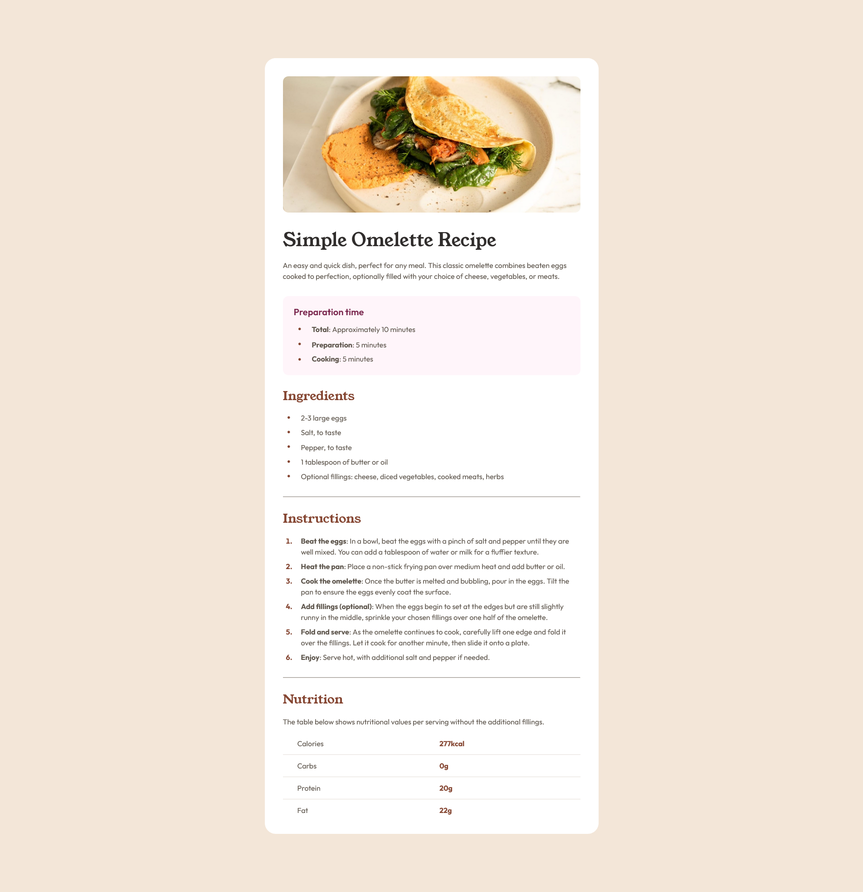

# Frontend Mentor - Recipe page solution

This is a solution to the [Recipe page challenge on Frontend Mentor](https://www.frontendmentor.io/challenges/recipe-page-KiTsR8QQKm). Frontend Mentor challenges help you improve your coding skills by building realistic projects. 

## Table of contents

- [Frontend Mentor - Recipe page solution](#frontend-mentor---recipe-page-solution)
  - [Table of contents](#table-of-contents)
  - [Overview](#overview)
    - [The challenge](#the-challenge)
    - [Screenshot](#screenshot)
    - [Links](#links)
  - [My process](#my-process)
    - [Built with](#built-with)
    - [What I learned](#what-i-learned)
    - [Continued development](#continued-development)
    - [Useful resources](#useful-resources)
  - [Author](#author)
  - [Acknowledgments](#acknowledgments)

## Overview

### The challenge

Users should be able to:
- View the layout of the recipe page as closely as possible to the design.
- Access a responsive design that adapts well to tablet and desktop devices.

### Screenshot



### Links

- Solution URL: [GitHub Repository](https://github.com/dantvi/recipe-page)
- Live Site URL: [DT Code](https://recipe-page.dtcode.se/)

## My process

### Built with

- Semantic HTML5 markup: To ensure clear and accessible content structure.
- CSS custom properties: For reusable theming and color consistency.
- Flexbox and Grid: Used to structure the layout and align content dynamically.
- Mobile-first workflow: Prioritized a design that works seamlessly across screen sizes.
- Google Fonts: Integrated fonts to enhance the visual appeal.

### What I learned

This project enhanced my skills in:
- CSS Grid:
  - Structured the nutritional values section using a clean and responsive grid layout.
- Typography and Styling:
  - Created a visually appealing recipe card using Google Fonts and custom styles.
- Responsive Design:
  - Adjusted images, layout spacing, and font sizes using media queries to ensure a great user experience on all devices.

Here’s an example of the grid layout for the nutritional information:

```css
.grid-container {
    display: grid;
    grid-template-columns: auto auto;
    row-gap: 1.2rem;
}

.grid-item-bold {
    color: var(--brown-800);
    font-weight: 700;
}
```

### Continued development

In future projects, I aim to:
- Explore more advanced CSS animations to enhance user engagement.
- Incorporate JavaScript for additional interactivity, such as step-by-step timers for recipes.
- Implement accessibility best practices, such as ARIA roles, to improve usability.

### Useful resources

- [MDN Web Docs: CSS Grid](https://developer.mozilla.org/en-US/docs/Web/CSS/CSS_grid_layout) - Helped create a well-structured grid layout for the nutrition table.
- [CSS Tricks: Media Queries](https://css-tricks.com/a-complete-guide-to-css-media-queries/) - Useful for managing breakpoints in responsive design.

## Author

- Frontend Mentor - [@dantvi](https://www.frontendmentor.io/profile/dantvi)
- GitHub - [@dantvi](https://github.com/dantvi)
- LinkedIn - [@danieltving](https://www.linkedin.com/in/danieltving/)

## Acknowledgments

Thanks to Frontend Mentor for providing a fun and engaging challenge. The structured design files were a great resource for practicing layout design, and the community insights inspired me to refine my approach.
